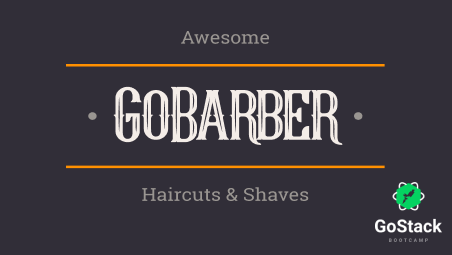

<div align="center">

# GoBarber Web

## Barbershop scheduling and management platform




<space><space>

<space><space>

<space><space>
[](https://github.com/leo-schlanger/gobarber-frontend/blob/master/LICENSE)

</div>

- [Description](#description)
- [Technologies](#technologies)
- [How to use](#how-to-use)
- [How to contribute](#how-to-contribute)
- [License](#license)

<a id="description" />

# :book: Description

An application developed in ReactJS using typescript language with the purpose of facilitating the service scheduling of barbers. It will store all customers and barbers and book appointments. Application developed in Rocketseat's GoStack Bootcamp. :rocket:

This application works together with 2 other applications, these are:

- [:file_cabinet: GoBarber API](https://github.com/leo-schlanger/gobarber-backend)
- [:iphone: GoBarber Mobile](https://github.com/leo-schlanger/gobarber-mobile)

---

<a id="technologies" />

# :rocket: Technologies

- [ReactJS](https://reactjs.org/)
- [GoBarber API](https://github.com/leo-schlanger/gobarber-backend)
- [Axios](https://github.com/axios/axios)
- [uuidv4](https://www.npmjs.com/package/uuidv4)
- [Unform](https://github.com/Rocketseat/unform)
- [react-router-dom](https://reacttraining.com/react-router/web/guides/quick-start)
- [styled-component](https://styled-components.com/)
- [polished](https://github.com/styled-components/polished)
- [date-fns](https://date-fns.org/)
- [react-day-picker](https://react-day-picker.js.org/)
- [react-spring](https://www.react-spring.io/)
- [yup](https://github.com/jquense/yup)

---

<a id="how-to-use" />

# :gear: How to use

Before running this application it is necessary to have the GoBarber API running, if you don't have it [click here](https://github.com/leo-schlanger/gobarber-backend).

After putting it to run, just follow the commands below in the terminal to start:

```Bash
# Install all dependencies
$ yarn install

# Run Web Application
$ yarn start
```

---

<a id="how-to-contribute" />

# :pushpin: How to contribute

Fork this repository.

```bash
# Clone the repository
$ git clone <repository-url> && cd <repository-folder>

# Create a branch with your feature or bug fix
$ git checkout -b <my-branch>

# Commit your changes
$ git commit -m 'feature/bugfix: my changes description'

# Push to your branch
$ git push origin <my-branch>
```

After the merge of your pull request is done, you can delete your branch.

---

<a id="license" />

# :memo: License

This project is under the MIT license. See the [LICENSE](https://github.com/leo-schlanger/gobarber-frontend/blob/master/LICENSE) for more information.

---

Made by Leo Schlanger :wave: [Get in touch!](https://www.linkedin.com/in/leo-schlanger-226467192/)
